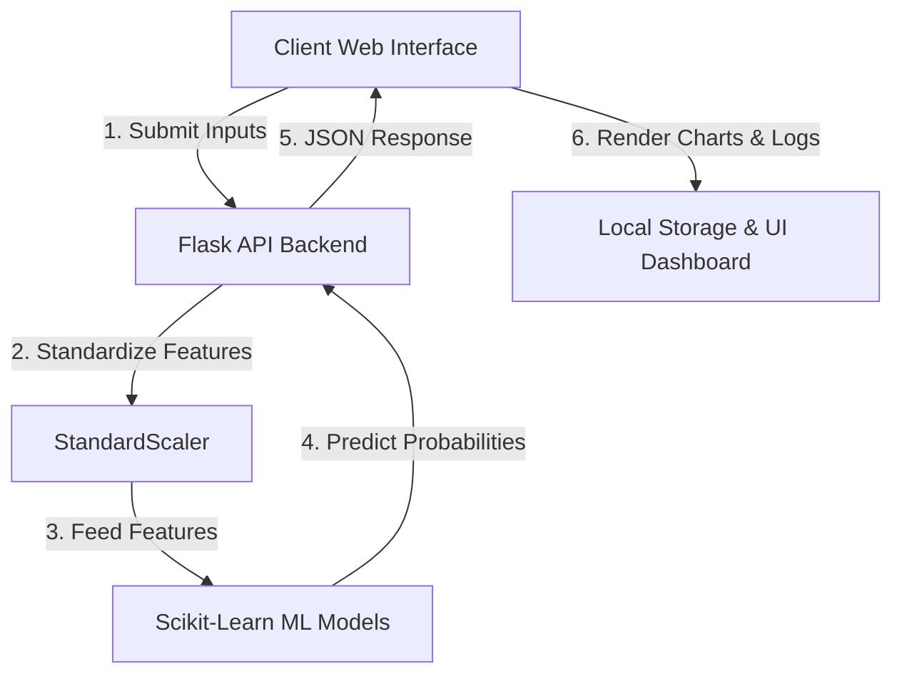

# UAJK AIS Society — MedAI Project & UI Overview

This document provides a comprehensive overview of the **MedAI Health Screening Platform** developed for the **University of Azad Jammu & Kashmir Artificial Intelligence Society (UAJK AIS)**. It details the current system, identifies UI bottlenecks, and highlights the premium features to be added to transform this into a high-end, user-friendly medical diagnostic application.

---

## 1. Project Overview

**MedAI** is an AI-powered health screening portal designed to empower early detection of chronic diseases. The platform integrates three distinct machine learning classifiers:

1. **Heart Disease Classifier (Gradient Boosting)**: Analyzes 13 clinical inputs to predict cardiovascular risks.
2. **Hypertension Classifier (Random Forest)**: Evaluates 19 lifestyle and clinical biomarkers (including BMI, lipids, and stress) to estimate high blood pressure risk.
3. **Diabetes Classifier (Optimized Random Forest)**: Uses 8 physiological factors (including glucose, insulin, and BMI) at an optimized threshold of `0.52` to screen for diabetes.

### Architecture

The system operates as a Full-Stack Single Page Application (SPA):
- **Backend (Python / Flask)**: Loads the models, standardizes user inputs using the pre-trained `StandardScaler` stats, runs predictions, and returns classification probabilities.
- **Frontend (HTML5 / Vanilla CSS / Vanilla JS)**: Captures user vitals, performs dynamic client-side animations, calls the Flask API, and displays diagnostics.

---

## 2. UI/UX Overview (Current vs. Upgraded)

### The Problem with the Current UI
- **Form Fatigue**: Displaying 13 or 19 input fields simultaneously in a static grid is overwhelming for patients, leading to cognitive fatigue.
- **Childish Elements**: Emoticons (🧬, ❤️, 🩺, 🍬) as primary branding make the application look like a basic student prototype rather than a real-world clinical application.
- **Basic Styling**: The visual structure is static. It lacks fluid application shells (like sidebars), real-world feedback loops, and advanced diagnostic reports.

### The Upgraded Design System (Clinical Tech Aesthetic)
We are upgrading the app with a **Space-Black Glassmorphic Medical Theme** using high-contrast neon clinical color variables:

| Style Element | Description | Token Value |
|---|---|---|
| **Background Primary** | Pure void space black | `#05070c` |
| **Background Secondary** | Dark medical slate | `#0b0f19` |
| **Glow Accent (Teal)** | High-fidelity medical highlight | `#00f2fe` |
| **Glow Accent (Indigo)** | High-fidelity intelligence highlight | `#4facfe` |
| **Panel Surface** | High blur backdrop glass | `rgba(10, 15, 30, 0.7)` |
| **Typography** | Modern sans-serif blend | `'Outfit', 'Inter', sans-serif` |

---

## 3. Detailed Breakdown of New Features

### Feature 1: Collapsible Application Sidebar Navigation
- **What it is**: Replaces the generic top navigation bar with a permanent, collapsible sidebar drawer commonly seen in modern Web Apps (e.g., dashboard consoles).
- **Why it is added**: Gives the app a "native software" look and feel.
- **How it works**: Uses icons to let users navigate between pages (Dashboard, Heart Screening, Hypertension, Diabetes, History Logs, Calculators, Info) without reloading the page.

### Feature 2: Interactive SVG ECG Oscilloscope
- **What it is**: A vector-drawn electrocardiogram (ECG) heartbeat line running in the header or home banner.
- **Why it is added**: Provides high-end visual feedback and adds an interactive "alive" feel to the medical theme.
- **How it works**: Built using an SVG path that animates along a coordinate axis. When a user runs a screening, the ECG speed and pulse frequency dynamically accelerate or decelerate to match the calculated risk level.

### Feature 3: Multi-Step Diagnostic Wizards
- **What it is**: Breaks the long list of questions into structured, bite-sized slides (e.g., Step 1: Personal Info, Step 2: Vitals & Lifestyle, Step 3: Lab Biomarkers).
- **Why it is added**: Makes screening simple, accessible, and user-friendly. Users focus on just 3–4 inputs at a time, eliminating form fatigue.
- **How it works**: CSS transitions fade out the current step and slide in the next. Progress indicator rings at the top indicate how close the user is to completion.

### Feature 4: Interactive Card Selector Chips
- **What it is**: Replaces traditional select dropdown lists and inputs with beautiful clickable card chips.
- **Why it is added**: Clicking graphical cards is much faster and more user-friendly than interacting with native browser dropdown options.
- **How it works**: Clicking a card visual (e.g., [Male] or [Female] card icons, or [Sedentary] / [Moderate] / [Active] exercise levels) updates a hidden form input and applies a glowing cyan border to show selection.

### Feature 5: Diagnostic Risk Analytics (Chart.js)
- **What it is**: A high-end analytics tab on the results screen displaying dynamic visual charts.
- **Why it is added**: A single risk number (e.g., "78% Risk") is not enough. Patients want to understand *why* their risk is high.
- **How it works**: Chart.js renders a horizontal bar chart mapping feature weights (e.g., high systolic BP, current smoking, and high cholesterol) visually showing which risk factors contributed most to the AI model's prediction.

### Feature 6: Local History Logs (Patient Records)
- **What it is**: A client-side registry storing history of all executed screenings.
- **Why it is added**: Allows users to compare results over time, track their health screenings, and maintain a local health journal.
- **How it works**: Uses HTML5 `localStorage`. Screenings are automatically saved with timestamp, model name, and risk score. Users can click any record to "Replay" the full interactive results card or clear the log.

### Feature 7: Health Calculator Library
- **What it is**: A helper tab featuring standard medical calculators (BMI Calculator, Blood Pressure Classifier, and Ideal Body Weight).
- **Why it is added**: Simplifies the main forms. Instead of guessing their BMI or systolic/diastolic categories, users calculate them in the sidebar tool.
- **How it works**: Users input height/weight in the BMI tool. It prints their category and features an **"Apply to Screening Form"** button, which auto-fills the BMI values across the active prediction pages.

### Feature 8: Clinical PDF Screening Report
- **What it is**: A printing template that formats the results page as an official clinical diagnostic printout.
- **Why it is added**: Allows users to save a clean PDF of their AI assessment or print it out to take to their healthcare provider.
- **How it works**: Integrates a `@media print` CSS template. When the user clicks "Download Report", it calls `window.print()`, formatting the results into a clean, grid-aligned clinical document complete with patient data, risk charts, recommendations, and a signature block.

### Feature 9: Smart Recommendation Engine
- **What it is**: A medical guideline system that scans the entered features to compile an actionable lifestyle guide.
- **Why it is added**: Translates abstract statistics into clear, actionable advice.
- **How it works**: Evaluates input parameters (e.g., Stress Level > 7, Sleep Duration < 6, Glucose > 120). It displays visual alert cards suggesting stress-relief programs, sleep hygiene guides, or diabetic nutrition advice based on which rules triggered.
